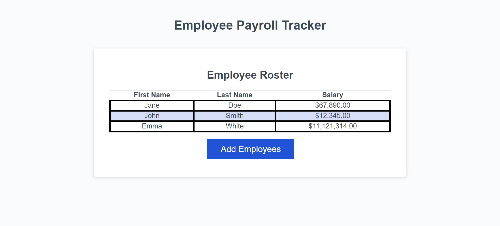
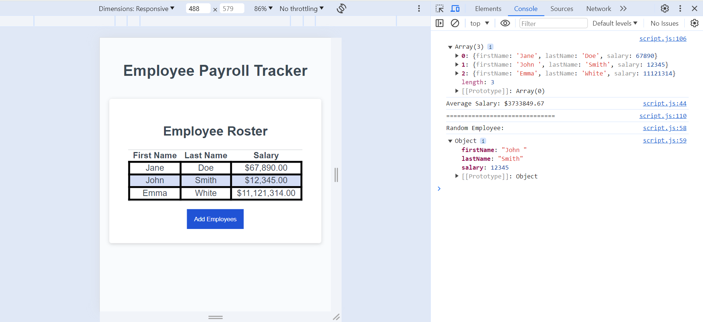

# Payroll Watchdog

 

## Desciption 

The Payroll Watchdog is a simple web application designed to assist payroll managers in tracking employee payroll data. With this tool, payroll managers can easily input and manage employee information, allowing for better budgeting and management of company resources.

## Usage

To use the Employee Payroll Tracker, follow these steps:

1.  Open the Employee Payroll Tracker application in your web browser.
2.  Click the "Add employee" button to begin adding employee data.
3.  Follow the prompts to enter the first name, last name, and salary of the employee.
4.  After entering the employee's information, choose to continue adding employees or cancel.
5.  If you choose to continue, repeat steps 3-4 for each additional employee.
6.  Once you have finished adding employees, their data will be displayed on the page sorted alphabetically by last name.

The following image shows the web application's appearance and functionality: 

[Visit my website](https://haartmuhn.github.io/payroll-watchdog/)

## License 

[MIT License](https://opensource.org/licenses/MIT)